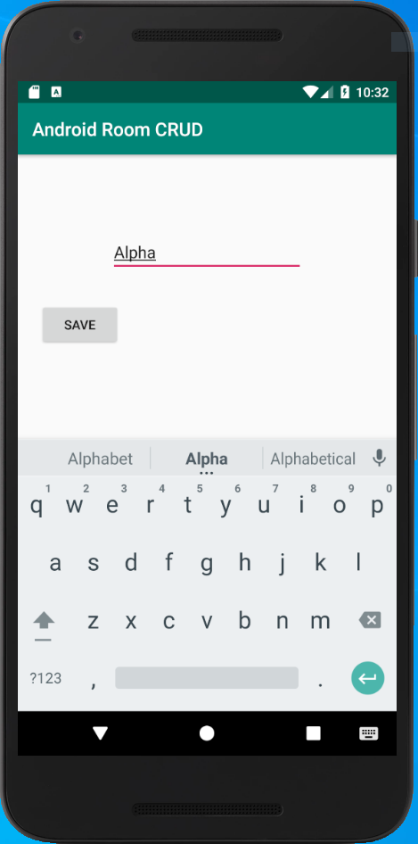
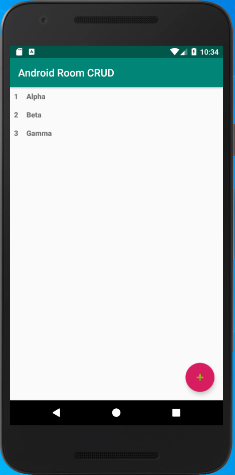
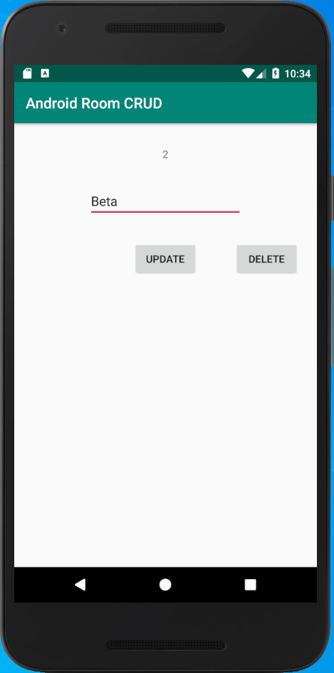
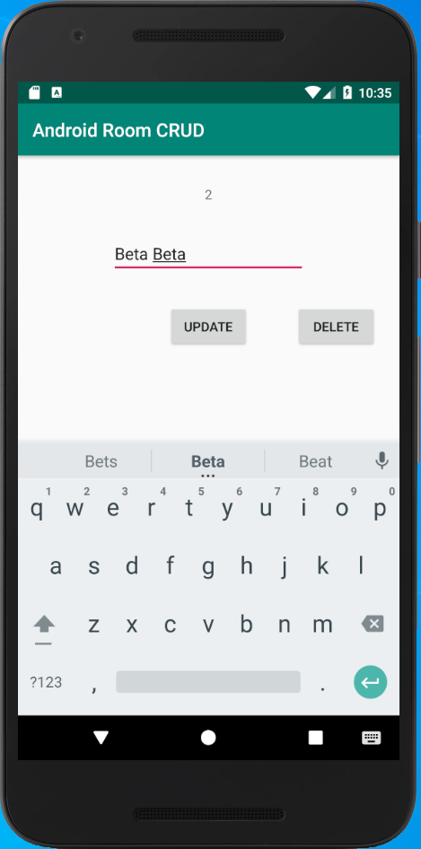
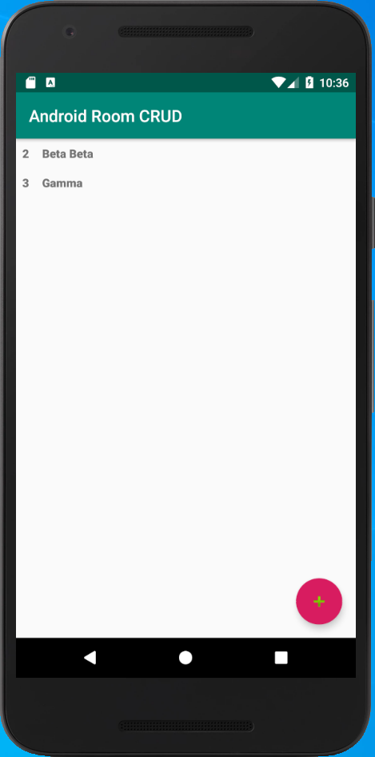

#################
Android Room CRUD
#################
An open source Kotlin sample application on how to holistically use `Android Room <https://developer.android.com/topic/libraries/architecture/room>`_ as a database backend for item list/detail workflow. All operations supported: Create, Read, Update and Delete.

========
Foreword
========
This is a very simple Kotlin implementation of CRUD using Room, and this app works.

I am however a Kotlin beginner, hence I am looking forward to receive corrections, suggestions, enhancements,
and possibly create additional samples using specific libraries that can make this workflow simpler, cleaner
and faster to implement.

For any of such cases, please submit a comment, open a bug, or make a PR.

====================
Application workflow
====================
A RecyclerView displays the list of all the stored items. A click on the Floating Action Button opens up the Create screen. A click on any of the list entry opens up the item detail view, allowing for individual item update and deletion.

##################
Technical overview
##################
`Android Room <https://developer.android.com/topic/libraries/architecture/room>`_ simplifies data persistency by abstracting many aspects of the interaction with the **SQLite database** used in the background. Additionally, using the library annotations, it avoids a lot of boilerplate code.

============
Data Classes
============
Follow along the code with explanation of the various classes introduced for handling data, and their purpose. Some of these classes must be replicated for each new database table you want to include.

----------------
class DataRecord
----------------
This is a Kotlin data class and using the Room annotations, it will map directly to a database table.

In this app, we will be storing a **record** of type **String**. Each record has an **id** of type **Long**, which is *autogenerated* and serves as the *primary key*. The database table is called **datarecords**.

-------------------
class DataRecordDao
-------------------
The next step is to define a **Database Access Object** class, which is where all the CRUD methods will be defined. Here you define function names, and associate them to database operations. You can use predefined ones, like **@Insert**, **@Update** and **@Delete**, or use **@Query** and define your custom query.

Note how input types can be either of type **DataRecord** (and might accept multiple items), or another type, like **Long**, and how such input parameter is referenced *inside* the query via the *":"*.

Also notice how some functions are defined as **suspend**, and how others are returning **LiveData**.

--------------------------
class DataRecordRepository
--------------------------
This class is typically used in between the application and the DAO. The reason for this extra layer is some extra flexibility that it allows. For example, the Repository could use multiple DAOs to build a final data response for the application. Also, the Repository could use multiple points of access to the data, say Cache, Local Database and Network, and use some logic to retrieve from one place rather than the other.

Since this application is quite simple, this Repository doesn't really do a whole lot more than basically re-writing the methods from the DAO.

---------------------
class AppRoomDatabase
---------------------
This is the class properly defines the SQLite database and ties all the tables together, plus more. In here you specify the desired database filename (or use default).

Also, make sure to specify **all** the data classes that are part of the model as *entities* of the **@Database**. In this example, there is only one: **DataRecord::class** , but you could have multiple.

Not implemented in this example app is a *Migration strategy*, which is the piece of code that will deal with *database schema changes* and will convert existing data to the new format upon database version update (signalled by the *version number* increase)

=========
UI Layout
=========
Without going into too many details, I will describe how this app works.

* We want to store and retrieve items of type **DataRecord**.
* We want a *create* button. When we click on this button, an empty dialog opens up allowing us to fill in the properties that make up a *DataRecord*, and then a button to *save* such record into the database.
* When we have a lot of items, we want to able to see them as a *list* and we want to be able to click on any of such list entries.
* When we click on any entry, a *detail page* should open, loading the values from the selected *DataRecord*, and allow us to *update* or *delete* it.

----------------------------------------------------------------------
classes DataRecordListActivity, DataRecordAdapter, DataRecordViewModel
----------------------------------------------------------------------
The activity loads the XML layout named `activity_datarecord_list` which is defined `activity_datarecord_list.xml`.
It exposes a *fab* *(Floating Action Button)*, which we will use for the *create* operation, using a new **Intent**.
Inside the layout, another layout is referenced: `data_record_list_recyclerview` which corresponds to file `data_record_list_recyclerview.xml` This is the one that will display the list of items by using a RecyclerView, whose ID is `datarecord_list`.

In summary, the *Activity* contains a *RecyclerView*, every line of which is a *ViewHolder*. Each *ViewHolder* is inflated and populated via the *Adapter*.

The order of operations (roughly) is:

1. Activity loads the activity layout, and also loads the RecyclerView nested layout.
2. Activity loads the ViewModel, which *already has a list of items*: **allItems**.
3. Activity iterates through every item inside *allItems* and calls the Adapter on each, to inflate the Adapter layout.

In this specific case, we use **LiveData** and **Observers** because we want to able to respond to data changes in the background: if the database is modified in the background, the UI will automatically reflect the change.

The Adapter also sets up a *Listener* for the *click* event: *OnClickListener* so that a new **Intent** will get fired up.

Note, however, that in this case we need a way to tell the Activity to load the details of the *current* item. Since each item is *uniquely identified* by their **id**, we will pass that to the *Intent* via *putExtra*.

----------------------
class DataRecordDetail
----------------------
This is the *Activity* for showing the *Detail page* of *Record data*, and also for creation of a new Record.
We reuse the same XML Layout to either Create a new Record or to Edit/Delete and existing one.

The way to distinguish the cases is through examination of the received *Intent*. If the intent has *Extra Data*, then it should be a case of *Edit/Delete* (with implicit Get). Otherwise, it will be a *new record create*.

The UI is designed with three static buttons, however we hide/show the appropriate buttons based on the same
analysis, so as to make it less confusing and error-prone.

All database operations are performed using an instance of the DataRecordViewModel.

#######
License
#######
**Android Room CRUD** is released under the MIT License.

The source code is available on GitHub at https://github.com/salvoventura/android-room-crud
